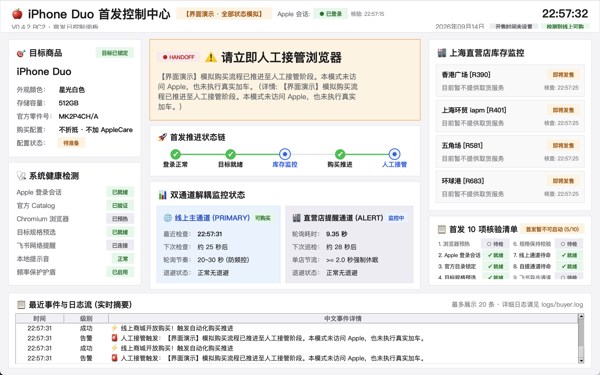
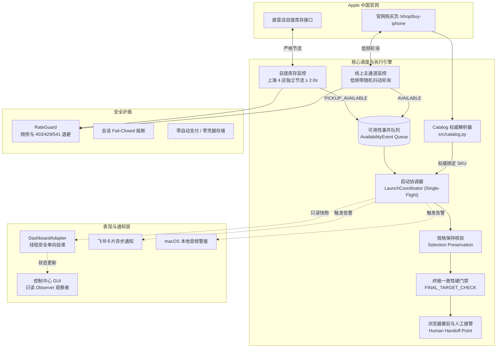

# iPhone Duo Launch Assistant

> **A safety-first, event-driven Apple China launch monitoring and purchase-assistance system with dynamic catalog verification, dual-channel availability tracking, and a native desktop dashboard.**
>
> **面向 Apple 中国官网新品首发场景的低频合规、规格强校验、全流程人工接管的桌面协同辅助系统。**

<p align="center">
  <a href="https://www.python.org/"></a>
  <a href="https://playwright.dev/"></a>
  <a href="docs/TESTING.md"></a>
  <a href="docs/SAFETY.md"></a>
  <a href="LICENSE"></a>
  
  
</p>

---

<div align="center">
  
  <p><em>首发协同控制中心 GUI（离线模拟演练模式，状态徽章、倒计时与事件流均为安全离线模拟）</em></p>
</div>

---

## 📌 项目定位

`iPhone Duo Launch Assistant` 是一个**面向 Apple 中国官网新品首发场景的低频、合规、人工接管型桌面协同辅助工具**。

在官方新品预售首发时刻（例如 `2026-10-16 20:00:00 CST`），系统帮助个人消费者平稳、确定地跟踪目标商品状态。本项目**坚决抵制任何黄牛秒杀与接口滥用行为**，严格遵循官方接口礼仪，所有不可逆操作（密码输入、双重认证 2FA、收件地址核对、最终付款）均由用户本人在官方原生浏览器界面亲自完成。

---

## ✨ 核心特性

- 🔍 **官方 Catalog 动态解析**：首发前动态请求并解析 Apple 官方商品配置树，双向映射颜色、容量与官方 Part Number，杜绝硬编码失效。
- 🎯 **权威 SKU 运行时锁定**：根据目标配置精准锁定唯一官方 Part Number（如星光白色 · 512GB 对应 `MK2P4CH/A`），启动时即完成配置绑定。
- 🔥 **规格预热与状态保留 (Selection Preservation)**：开售前预选目标机型配置并就绪；开售瞬间优先核验保留状态，跳过冗余点击，实现极速就绪。
- 🛡️ **加车前终极规格硬门禁 (`FINAL_TARGET_CHECK`)**：在加车前最后一步执行权威规格一致性校验；任何目标规格或 SKU 不一致均立即 Fail-Closed，严防下错订单。
- 🌐 **双通道解耦监控**：
  - **线上渠道 (Online)**：对官方购买页状态实施带随机抖动的低频合规轮询；
  - **自提渠道 (Pickup)**：并行监控上海 4 家官方直营店（香港广场、上海环贸 iapm、五角场、环球港）的自提现货。
- ⏱️ **RateGuard 频控与多级指数退避**：遭遇 HTTP 403 / 429 / 541 边缘拦截响应时，自动触发阶梯退避（60s $\to$ 120s $\to$ 240s）并平滑恢复，坚决不轰炸官网。
- 🔒 **严格会话 Fail-Closed**：开售前检测到 Apple Account 登录态失效立即全链路熔断告警，拒绝以未登录降级状态盲目推进。
- 🚀 **单飞抢占机制 (Single-Flight)**：线上主通道触发购买后自动锁定执行上下文，忽略后续重复事件，杜绝并发竞争与重复加车。
- 👤 **浏览器置前与人工安全接管 (Human Handoff)**：购买流程推进至人工接管阶段后，系统自动将 Chromium 窗口置前，并通过本地声音与飞书通知提醒用户接管，由用户亲自核对地址与完成支付。
- 🖥️ **纯中文首发协同控制中心**：基于原生 Tkinter 构建的现代化桌面看板，采用只读观察者模式，提供倒计时、10 项就绪清单与实时结构化事件流。

---

## 🧠 设计原则 (Design Principles)

1. **Safety First (Fail-Closed)**：宁可安全终止，绝不带病运行。遇到登录态失效、规格不一致、接口未知结构等任何异常，系统主动熔断。
2. **Low Frequency & Polite**：遵循官方接口礼仪。线上轮询保持 20~30 秒带抖动间隔，直营店轮询严格执行单店 $\ge 2.0$ 秒休眠节流，配合 RateGuard 多级退避护盾。
3. **Event-Driven & Decoupled**：监控通道、调度中枢、通知网关与展示界面全面解耦，基于异步事件驱动与单飞锁运行。
4. **Human in the Loop**：系统只负责监控、规格校验与窗口推进。密码输入、两步验证、地址核对及最终付款完全由用户本人在原生官方界面中操作。
5. **Observable (Observer Pattern)**：控制中心 GUI 作为纯只读观察者运行在独立线程，与执行引擎严格隔离，界面任何异常绝不影响底层业务安全。

---

## 🏗️ 架构概览



> 详细架构设计文档请阅读 [📐 docs/ARCHITECTURE.md](docs/ARCHITECTURE.md)。

---

## 📊 性能与基准验证 (Controlled Runtime Verification)

在受控运行时验证（Controlled runtime verification）环境下，系统的关键响应时延指标如下：

| 关键阶段 | 测量时延 | 说明与保障机制 |
| :--- | :--- | :--- |
| **Catalog 权威解析** | $\approx 10\text{ ms}$ | 本地 JSON 结构化索引缓存，零网络阻塞 |
| **$T_0 \to$ FINAL_TARGET_CHECK** | $\approx 1.13\text{ s}$ | 预选状态完整保持，跳过冗余点击快速执行权威门禁核验 |
| **$T_0 \to$ HUMAN_HANDOFF_SIMULATION_READY** | $\approx 1.26\text{ s}$ | 推进至人工接管模拟就绪点，触发窗口置前与通知告警 |

> ⚠️ **特别说明**：上述数据来源于**受控运行时验证 (Controlled runtime verification)**。**真实 `add_to_bag` 与 `checkout` 在该受控验证流程中被物理阻断，因此这些数据不代表真实完整下单耗时。**

---

## 🛡️ 安全合规与行为边界

| 行为类别 | 系统的处理方式 |
| :--- | :--- |
| **Apple ID 密码** | **绝不保存、绝不托管、绝不自动代填**。完全由用户在原生 Chromium 窗口中输入。 |
| **双重认证 (2FA)** | **绝不拦截、绝不自动处理**。遇到 2FA 弹出时提示用户在手机/受信任设备上授权。 |
| **人机验证 (CAPTCHA)** | **不内置任何破解服务**。遇到滑块或验证码立即触发声光告警转交人工。 |
| **请求频次与网络合规** | **严格受控**。单店节流 $\ge 2.0$ 秒，线上轮询间隔 20~30 秒，严禁高频轰炸。 |
| **最终支付与扣款** | **绝无自动支付**。系统在到达结账准备页面时强制停机，由用户亲自核验并付款。 |
| **成功率承诺** | **本工具为辅助工具，不声称、不承诺任何购买成功保证**。 |

> 完整安全机制说明请阅读 [🛡️ docs/SAFETY.md](docs/SAFETY.md)。

---

## 🧪 自动化测试套件

本项目拥有完备的密封式离线自动化测试套件，全面覆盖 Catalog 解析、状态机跃迁、退避护盾、通知去重、GUI 观察者模式以及终极门禁失败注入：

```bash
# 执行全量 293 项自动化回归测试
.venv/bin/python -m unittest discover -s tests -p "test_*.py"
```

当前冻结版本测试报告：
```text
Ran 293 tests in 12.268s

OK (0 failures, 0 errors)
```

> 详细测试用例分布与失败注入场景请阅读 [🧪 docs/TESTING.md](docs/TESTING.md)。

---

## 🚀 快速上手

### 1. 运行环境准备

要求 **macOS** 操作系统与 **Python 3.10+**（推荐 Python 3.11+）。

```bash
# 1. 克隆仓库
git clone https://github.com/ruoxi9969/iphone-duo-launch-assistant.git
cd iphone-duo-launch-assistant

# 2. 创建并激活虚拟环境
python3 -m venv .venv
source .venv/bin/activate

# 3. 安装依赖包
pip install -r requirements.txt

# 4. 安装 Playwright 原生浏览器内核
playwright install chromium
```

### 2. 初始化本地配置

从模板复制并生成本地运行配置：

```bash
cp config.example.yaml config.yaml
```

在本地 `config.yaml` 中配置目标商品参数与自提门店信息（可选配置飞书通知 Webhook）：

```yaml
target_product:
  model: "iphone-duo"
  color: "星光白色"
  storage: "512GB"
  sku: "MK2P4CH/A"
```

> 🔒 **隐私保护**：`config.yaml` 已被 `.gitignore` 严格忽略，绝不会被提交至版本库。

### 3. 可用命令与运行模式

#### 模式 A：控制中心离线模拟演练 (推荐首选)

在不发任何真实网络请求、不打扰官网的前提下，熟悉控制中心界面与全流程模拟演练：

```bash
python -m src.main --mode dashboard-demo
```

> 详细看板交互与视觉组件说明参见 [🖥️ docs/DASHBOARD.md](docs/DASHBOARD.md)。

#### 模式 B：持久化浏览器会话准备 (首发日前操作)

拉起原生 Chromium 浏览器，由您本人登录 Apple ID：

```bash
python -m src.main --mode prepare-session
```

- 浏览器窗口打开后，请登录您的 Apple ID 并完成双重认证 (2FA)；
- 登录成功后直接关闭浏览器窗口。Apple 登录会话持久化保存在本地 Chromium Profile（browser_data/）中。该目录被 .gitignore 排除，不进入 Git 仓库。

#### 模式 C：会话有效性与网络连通性巡检

在首发前巡检登录态与网络环境：

```bash
python -m src.main --mode check-session
```

- 核验 Apple ID 登录态是否有效；
- 核验上海 4 家官方直营店网络连通性与响应时间；
- 核验飞书通知 Webhook 连通性。

#### 模式 D：首发实战协同控制中心

在官方新品预售首发时刻前（如提前 10~15 分钟）启动：

```bash
python -m src.main --mode launch-dashboard
```

- 系统将自动加载会话、动态解析 Catalog 锁定 SKU、预热目标机型并保持选择；
- 启动低频双通道监控与 RateGuard 护盾；
- **当开售信号触发时，系统核验规格并推进至人工接管阶段，随后自动将浏览器置前并通过声音与通知提醒，由您本人亲自完成付款**。

---

## 🔒 本地私有数据保护

为确保用户隐私与个人数据绝对安全，以下文件与目录由 `.gitignore` 严格保护，**仅保存在用户本地，绝不提交至任何公开仓库**：

| 文件 / 目录 | 用途说明 | 安全保护机制 |
| :--- | :--- | :--- |
| `config.yaml` | 本地真实配置文件（含私有 Webhook 等） | Git 忽略，仅保留 `config.example.yaml` 模板 |
| `browser_data/` | Chromium 用户配置目录（含 Cookies、Session） | Git 忽略，绝不上云 |
| `state/` & `cache/` | 运行时状态快照与官方 Catalog 本地缓存 | Git 忽略，每次运行自动管理 |
| `logs/` | 运行时日志输出目录 | Git 忽略，自动滚动清理 |
| `private_reports/` | 内部开发归档与安全审计报告 | Git 忽略，完全隔离于版本库 |

---

## 📚 详细技术文档索引

- 📐 [系统技术架构与全链路流程 (Architecture)](docs/ARCHITECTURE.md)
- 🛡️ [安全设计与合规边界 (Safety & Compliance)](docs/SAFETY.md)
- 🖥️ [首发实战协同控制中心 (Dashboard)](docs/DASHBOARD.md)
- 🧪 [自动化测试与质量保障体系 (Testing & QA)](docs/TESTING.md)

---

## 📄 开源许可证

本项目基于 [MIT License](LICENSE) 协议发布。

---

## ⚠️ 免责声明 (Disclaimer)

### English
This repository is an independent, personal open-source project developed for technical exploration and educational purposes. It is not affiliated with, authorized by, endorsed by, or in any way connected with Apple Inc. or any of its subsidiaries or affiliates. The official Apple website can be found at https://www.apple.com. Apple, iPhone, and related brand names and trademarks are the registered trademarks of Apple Inc. Use of this project is at your own risk. The author does not guarantee product availability, purchase success, or uninterrupted operation.

### 中文
本项目为个人技术探索与学习交流的独立开源项目，与 Apple Inc.（苹果公司）及其关联公司不存在任何形式的官方隶属、授权、背书或合作关系。Apple 官方网站为 https://www.apple.com。Apple、iPhone 及相关商标权归 Apple Inc. 所有。本项目仅供个人在符合平台规则的前提下参考使用，作者不对任何购买结果、库存变动或系统可用性做任何形式的明示或暗示保证。
